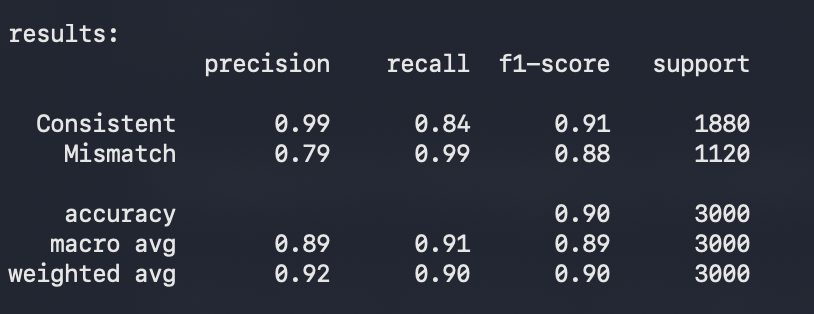

# Support Integrity Auditor (SIA)

Detects priority mismatches in CRM support tickets using self-supervised learning — no pre-labeled mismatch data needed.

**Live App:** https://sia-projectmarstickets-t4gzajru3ohrovuqff7stn.streamlit.app  
**Model:** https://huggingface.co/aryansharma72062/sia-distilbert




---

## What it does

Support agents sometimes mislabel ticket priorities — a critical outage gets marked Low, a font complaint gets marked Critical. SIA detects these automatically and classifies them as:

- **Hidden Crisis** — assigned too low (e.g. Low but actually High/Critical)
- **False Alarm** — assigned too high (e.g. Critical but actually Low)

---

## How it works

### Pseudo-label generation

The dataset has no pre-labeled mismatches so we generate training labels ourselves using two independent signals.

**Signal 1 — NLP:** keyword density (crisis words, escalation phrases), text length, channel urgency. We found this signal weaker than expected because the dataset text is partially synthetic — descriptions don't always contain natural urgency language. Agreement with human labels: 39.4%.

**Signal 2 — Resolution time anomaly:** within each priority group, tickets resolved much faster than typical (bottom 15%) were probably more urgent than labeled. Tickets taking much longer than typical (top 85%) were probably over-labeled. Agreement with human labels: 75.8%.

Because Signal 2 turned out significantly stronger, we weighted the fusion 60/40 in its favor:
```
inferred = round(0.4 × NLP + 0.6 × resolution_anomaly)
mismatch = 1 if |inferred - assigned| >= 1
```

Pairwise signal agreement (S1 vs S2): 40.4% — confirms they are genuinely independent signals.

### Classifier

Fine-tuned DistilBERT on the pseudo-labeled data. Froze transformer layers 0-3 to prevent overfitting on noisy labels, trained layers 4-5 plus classifier head (~14.7M params). Input includes ticket text, assigned priority, resolution time bin, channel, category, and customer tier.

### Dossier

For every flagged ticket — a structured JSON report with keyword evidence, resolution time interpretation, and LLM-generated analysis (Mistral-7B via Ollama locally, template fallback on hosted app). Every evidence item traces directly to an actual ticket field.

---

## Results

| Metric | Result |
|---|---|
| Accuracy | 90% |
| Macro F1 | 0.89 |
| Recall (Consistent) | 0.84 |
| Recall (Mismatch) | 0.99 |

---

## Setup

```bash
python3.11 -m venv sia-env
source sia-env/bin/activate
pip install -r requirements.txt

# dataset: kaggle.com/datasets/ajverse/customer-support-tickets-crm-dataset
mkdir data && mv support_tickets.csv data/

# optional: for full LLM dossier analysis
brew install ollama && ollama pull mistral && brew services start ollama

python train_pipeline.py
streamlit run app.py
python predict.py --input tickets.csv --output results.csv
```

---

## Files

```
├── data_exploration.ipynb    EDA and pseudo-label generation
├── model_training.ipynb      model training and evaluation
├── train_pipeline.py         standalone training script
├── predict.py                inference on new CSV
├── app.py                    Streamlit web app
├── requirements.txt
├── demo_tickets.csv          25 test tickets for demo purposes
├── data/                     dataset (gitignored)
└── models/                   model (gitignored, hosted on HuggingFace)
```

The trained model is hosted on HuggingFace because it's ~270MB — too large for GitHub. The app downloads it automatically on first startup.

---

## Known Issues

**Streamlit is single-threaded** — clicking in one tab while another is processing cancels the ongoing operation. Finish one thing before starting another.

**demo_tickets.csv** — manually created 25-ticket test file covering Hidden Crisis, False Alarm, and consistent cases. Used for demo because the full 20k dataset takes 5-10 minutes to process.

**Ollama not available on hosted app** — the constraint analysis uses a template fallback on Streamlit Cloud since Ollama runs locally only. Still grounded, no hallucination.

**NLP signal on synthetic data** — keyword matching works better on real support tickets with natural language. On this dataset the resolution time signal carries most of the weight.

---

## Future Work

- Use real enterprise ticket data for stronger NLP signal
- Add LLM-based zero-shot scoring as a third signal
- Implement adaptive resolution time thresholds that update as new tickets come in
- Build a feedback loop so agents can confirm/reject flags, creating real labeled data over time
